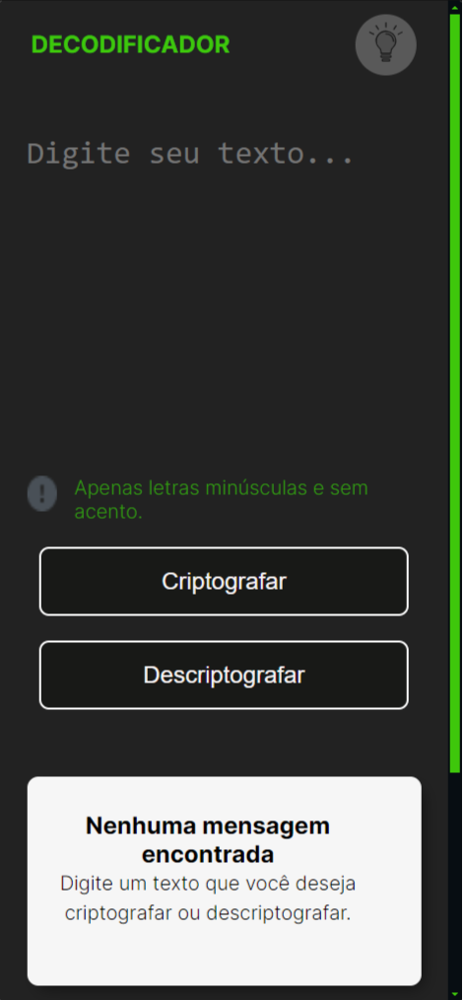

# Decodificador de texto

Este projeto é um decodificador de texto, onde o usuário escreve algo que queira encriptar e a mensagem encriptada é exibida em um texto ao lado.

## 🔨 Funcionalidades do projeto

O decoficador tem como funcionalidade os botões, um para encriptar a mensagem, outro para copiar a mensagem encriptada e um para descriptar a mensagem que foi inserida anteriomente.

## ✔️ Tecnologias utilizadas

- `HTML5`
- `CSS3`
- `JavaScript`

## 🎯 Desafio

Tela do projeto em responsivo

## 📁 Acesso ao projeto

Você pode [acessar o código fonte do projeto inicial](https://github.com/alura-cursos/android-com-kotlin-personalizando-ui/tree/projeto-inicial) 

